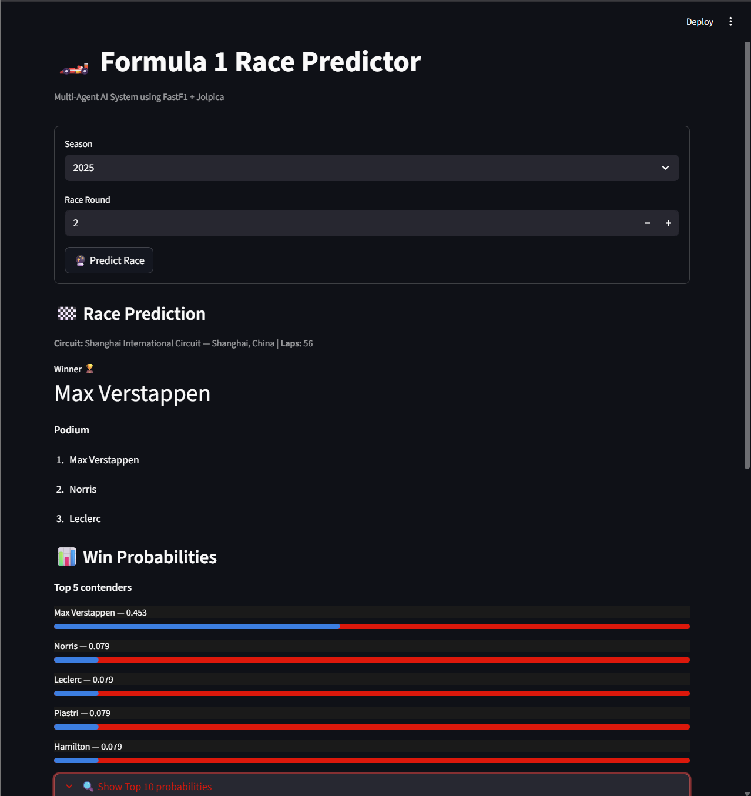
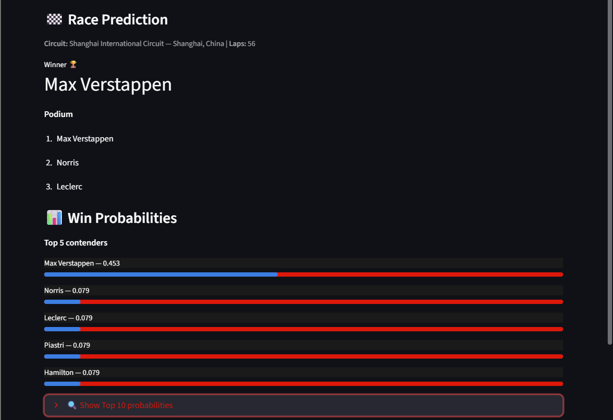
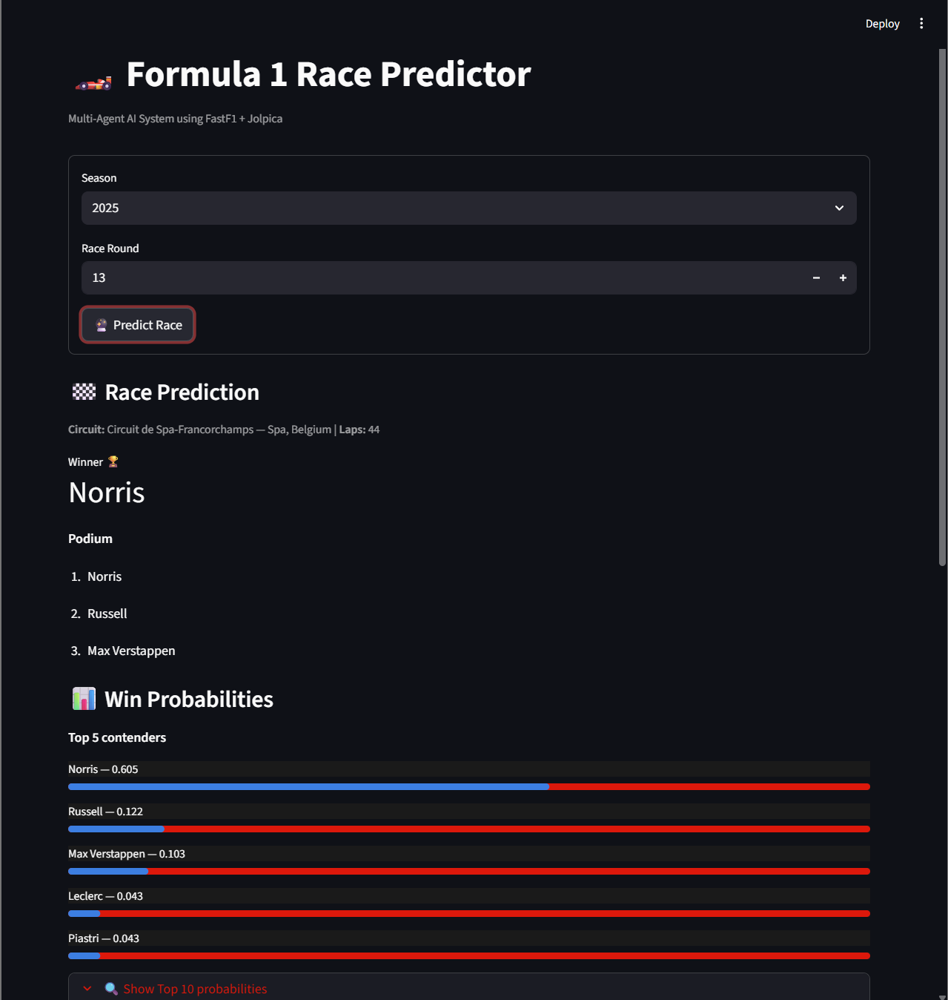
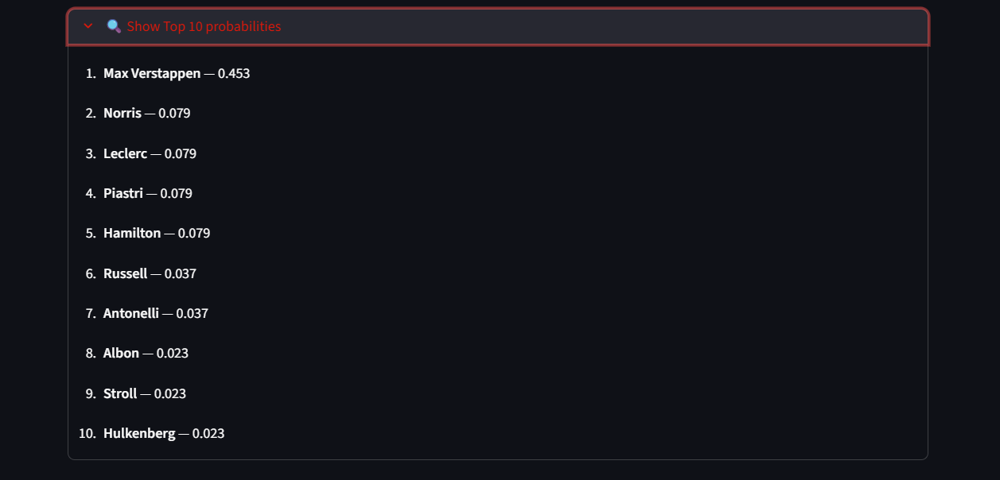
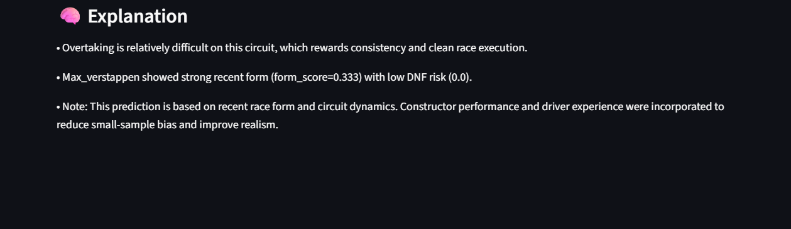

# Formula 1 Race Predictor  
### Multi-Agent AI System for Formula 1 Race Outcome Forecasting

An explainable, multi-agent AI system that predicts Formula 1 race winners and podiums by combining **circuit characteristics**, **driver form**, and **constructor dominance** using real-world F1 data.

---

## Overview

This project implements a **modular, multi-agent decision-support system** for Formula 1 race outcome prediction.

Instead of using a single black-box model, the system decomposes the prediction task into **specialized agents**, each responsible for modeling a key aspect of Formula 1 race dynamics.  
The final output is a **calibrated probability distribution**, not an overconfident guess.

The project emphasizes:
- Explainability
- Probabilistic realism
- Robust system design
- Clean user-facing visualization

---

## System Architecture (Multi-Agent Design)


### Agent Responsibilities

#### Circuit Agent
Analyzes track-specific characteristics:
- Qualifying importance  
- Overtaking difficulty  
- Safety car risk  
- Lap count  

These features determine how much grid position, consistency, and race chaos matter for a given circuit.

---

#### Driver Agent
Evaluates short-term driver performance:
- Recent finishing positions  
- Consistency metrics  
- DNF (Did Not Finish) risk  
- Qualifying performance deltas  
- Form score  

Focuses on **current momentum**, not historical reputation.

---

####  Constructor Agent
Models team-level performance:
- Average finish position  
- Points per race  
- DNF rate  
- Constructor dominance score  

Reflects the real-world impact of team strength in Formula 1.

---

####  Fusion Agent (Core Intelligence)
Combines all upstream signals into final predictions.

Key techniques:
- Z-score normalization for comparability  
- Experience regularization to reduce small-sample bias  
- Constructor dominance priors applied post-normalization  
- Temperature-scaled softmax for realistic probability calibration  

Outputs:
- Predicted winner  
- Podium (Top 3)  
- Full probability distribution  

---

#### Explainability Agent
Produces human-readable explanations describing:
- Why a circuit favors certain drivers  
- How qualifying, consistency, and team strength influenced the outcome  
- Why uncertainty remains even for strong favorites  

This makes the system suitable as a **decision-support tool**, not a black box.

---

##  Example Output

The system generates:
- 🏆 Predicted race winner  
- 🥇🥈🥉 Podium order  
-  Win probability bars (Top 5 + expandable Top 10)  
- Natural-language explanations  

Probabilities are **explicitly calibrated** to avoid unrealistic confidence.

---

## Visual Overview

Dashboard & Input Selection
<p align="center">  </p>
Race Prediction Output
<p align="center">  </p>
Alternate Prediction View
<p align="center">  </p>
Win Probabilities (Top 5 + Top 10)
<p align="center">  </p>
Explainability Output
<p align="center">  </p>
---

##  User Interface

- Built with **Streamlit**
- Custom **Red Bull–inspired dark theme** (red + black)
- Interactive season and race selection
- Clean probability visualization and explanations

The UI is designed to resemble an **F1 telemetry / strategy dashboard**.

---

##  Data Sources

- **FastF1** — detailed race and session-level data  
- **Jolpica API** (Ergast successor) — drivers, constructors, results  

Data is fetched dynamically and cached locally to respect API rate limits.

---

##  Design Philosophy & Limitations

### What this system is
- An explainable AI decision-support system  
- A modular, multi-agent architecture  
- A realistic probabilistic predictor  

### What this system is not
- A betting or gambling model  
- A guaranteed race outcome predictor  
- A black-box deep learning system  

The system intentionally prioritizes **interpretability and calibration** over aggressive predictions.

---

##  Running Locally

```bash
# Create virtual environment
python -m venv .venv
source .venv/bin/activate  # Windows: .venv\\Scripts\\Activate.ps1

# Install dependencies
pip install -r requirements.txt

# Run the app
streamlit run ui/app.py
=======


